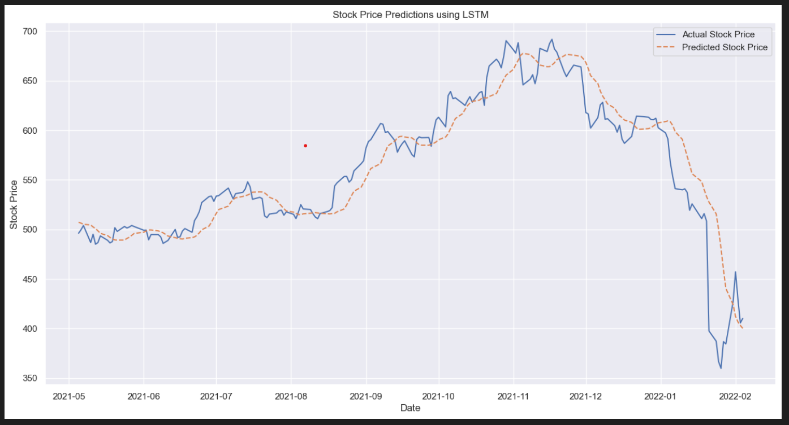
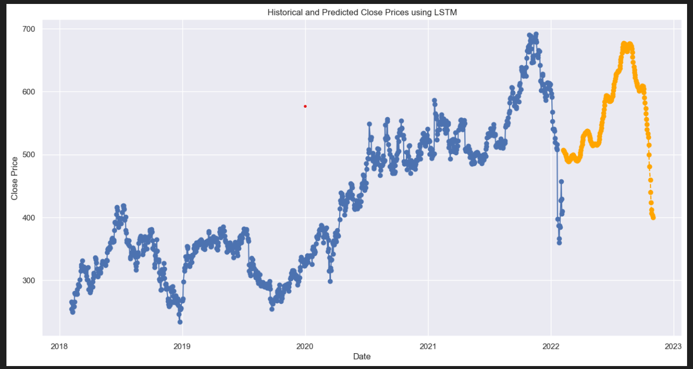

# Netflix Stock Market Prediction

## OVERVIEW
Netflix Stock Market Prediction adalah proyek analisis dan prediksi harga saham Netflix menggunakan data historis. Tujuannya adalah untuk memprediksi harga saham di masa depan dengan menggunakan berbagai metode analisis data dan teknik machine learning. Dalam proyek ini, data harga saham Netflix diambil dari sumber seperti Yahoo Finance, kemudian dilakukan preprocessing, analisis visual, dan model prediksi dibangun.
Model prediksi dapat menggunakan algoritma LSTM (Long Short-Term Memory), yang sering digunakan dalam prediksi data deret waktu. Proyek ini memberikan wawasan tentang tren historis, volatilitas, dan pola pergerakan saham, serta membantu memproyeksikan harga saham untuk keputusan investasi yang lebih baik.

---

## SCREENSHOTS
### Stock Price Prediction Using LSTM

### Historical and Predicted Close Prices using LSTM
